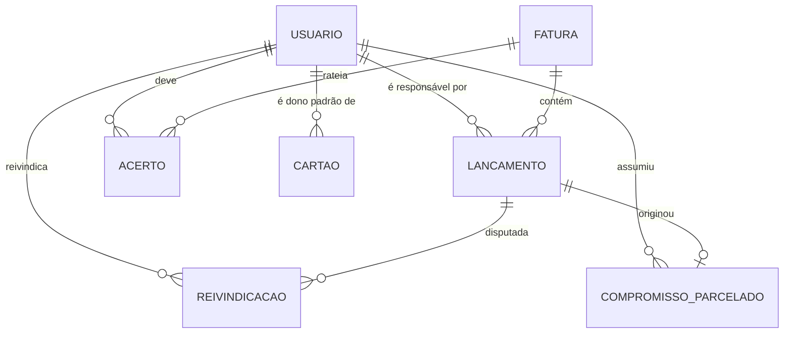
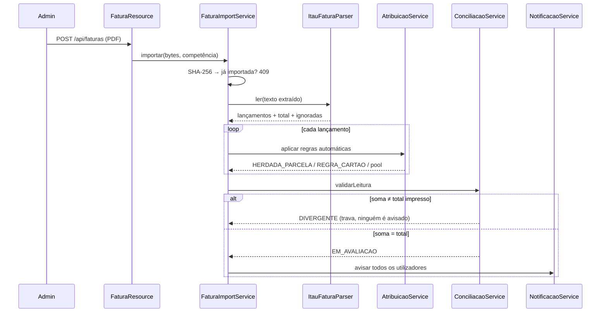

# Arquitetura

## Camadas

```
resource  →  service  →  entidade (Panache)
   ↓
  DTO (record)
```

- **resource** — HTTP, autorização (`@RolesAllowed`) e montagem do DTO.
- **service** — regra de negócio e fronteira transacional.
- **entidade** — Panache, com as consultas nomeadas como métodos estáticos.

Entidade nunca vai direto para a API: além do risco de vazar campo (hash de
senha, texto do PDF), o formato da resposta é decisão do `Responses`.

Erro de negócio é `WebApplicationException` com a mensagem escrita para o
usuário; o `ErrorMapper` transforma em `{message, status}`. Acima de 500 a
mensagem vira genérica e o detalhe fica no log.

## Modelo de dados



### Por que cada tabela existe

| Tabela | Razão de existir |
|---|---|
| `usuario` | Papéis como **flags** (`admin`, `utilizador`): o titular é os dois — administra e também gasta no próprio cartão |
| `cartao` | A fatura vem seccionada por portador; `dono_padrao_id` atribui sozinho o adicional que é sempre da mesma pessoa |
| `fatura` | `hash_pdf` é UNIQUE (importar duas vezes é rejeitado). Guarda `texto_extraido`, não o PDF |
| `lancamento` | A unidade que alguém assume. `responsavel_id` nulo = está no **pool** |
| `reivindicacao` | Registro de quem pediu o quê. Duas pendentes no mesmo lançamento = **conflito** |
| `compromisso_parcelado` | Onde mora a regra "parcelamento gruda" |
| `acerto` | Quanto cada um deve numa fatura + ciclo de quitação |
| `auditoria` | Num app onde se assume dívida, "quem marcou o quê" precisa ser incontestável |

### Decisões de schema que não são óbvias

- **`EntidadeBase` com `GenerationType.IDENTITY`.** O schema usa `BIGSERIAL`. O
  `PanacheEntity` padrão declara o id como `AUTO`, que no Hibernate 6 vira uma
  sequence `<entidade>_seq` inexistente — o app nem sobe.
- **`EntidadeBase.getId()`.** Ler `entidade.associacao.id` direto num proxy lazy
  devolve **null em silêncio**: o campo público pertence à instância real, não ao
  proxy, e acesso a campo não passa pelo interceptador. O getter passa, e ainda
  resolve o id sem disparar SELECT. **Use sempre o getter em associação.**
- **`ck_lancamento_atribuicao`.** Responsável e origem andam juntos ou são ambos
  nulos — impede um lançamento "de ninguém, mas com origem".
- **Índice parcial `idx_lancamento_pool`.** A consulta mais quente é "o que está
  sem dono nesta fatura", a tela principal do utilizador.
- **`auditoria.usuario_nome` desnormalizado.** O registro sobrevive à exclusão do
  usuário.

## Transações

Duas armadilhas apareceram rodando o app e ambas têm teste de regressão:

**1. Serviços recebem `Long id`, não entidade.** Uma entidade carregada em outra
transação chega destacada, e `persist()` nela estoura com *detached entity passed
to persist*. Recarregar pelo id dentro da transação torna o serviço seguro
independentemente de quem chama.

**2. Endpoints que montam DTO são `@Transactional`.** O DTO é construído no método
do resource; se a transação do serviço já fechou, tocar uma associação lazy
(`acerto.fatura.competencia`) levanta `LazyInitializationException`. Manter a
sessão aberta durante o mapeamento resolve sem precisar de EAGER — que traria
N+1 nas listagens.

## Fluxo de uma importação



O e-mail sai **depois** da validação: não faz sentido pedir avaliação de uma
fatura que o parser leu errado.

## E-mail assíncrono

`NotificacaoService` publica no EventBus e o `EmailDispatcher` consome numa worker
thread (`@Blocking`). Importar uma fatura dispara N e-mails; enviá-los em série
dentro da transação faria o upload esperar o SMTP N vezes e prenderia a conexão
do banco. Falha de envio vira log, nunca desfaz a operação.

## Segurança

- **JWT RS256**, chaves em volume `/keys` gravado pelo CD a partir dos secrets —
  a imagem não carrega segredo e os tokens sobrevivem ao deploy.
- **Papéis como groups** do token: o titular sai com `ADMIN` e `UTILIZADOR`.
- **`UsuarioLogado` relê do banco** a cada requisição: um token válido pode ser de
  alguém desativado depois da emissão, e num app de cobrança isso não pode passar.
- **Anti-força-bruta** no login (5 tentativas / 15 min), em memória — uma tabela a
  mais não compensa para poucos usuários, e o atacante não controla o restart.
- **Senha provisória barra a navegação** até ser trocada, no backend e no guard.
- **CORS desligado** em produção: o nginx faz o proxy de `/api`, então é
  same-origin. Só o perfil `dev` libera o `:4200`.

## Frontend

Componentes **standalone** com **signals**, rotas com `loadComponent` (o bundle
inicial fica em 84 kB para abrir rápido no celular), um único `ApiService` e
`ToastService` para todo retorno. Sem framework de UI: o app tem poucas telas e o
peso no celular importa mais que a conveniência.

O interceptor anexa o JWT e traduz o erro do backend; 401 derruba a sessão
dizendo o motivo, em vez de deixar a tela mudinha.

O service worker faz **network-first** no app shell (deploy novo aparece na hora)
e **ignora `/api`** por completo.
