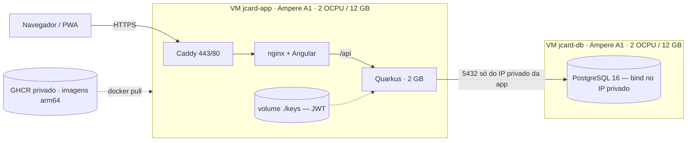

# Topologia de produção

Referência autoritativa da infraestrutura. Duas VMs **Always Free** na Oracle
Cloud, imagens buildadas no CI e publicadas no GHCR.



## Por que Ampere A1, e não E2.1.Micro

O par de `VM.Standard.E2.1.Micro` do Always Free **já está todo em uso** pelo
projeto `ebd-samambaia`:

```
vm-standard-e2-1-micro-count →  used: 2, available: 0
standard-a1-core-count       →  used: 0   (Always Free: 4 OCPU)
standard-a1-memory-count     →  used: 0   (Always Free: 24 GB)
```

Duas A1 de 2 OCPU / 12 GB somam exatamente o teto Always Free → **US$ 0**, com
12x mais RAM que as VMs do EBD. O custo é que A1 é **ARM64**, o que muda a forma
de buildar as imagens (ver [CICD.md](CICD.md)).

**Capacidade é o gargalo.** `sa-saopaulo-1` devolve "Out of host capacity" com
frequência para Ampere. `scripts/oci-a1-retry.sh` insiste em segundo plano e,
após ~40 minutos, reduz o pedido para 1 OCPU / 6 GB por VM — ainda 6x a RAM das
VMs do EBD.

## Rede

Criada em 07/08/2026, **isolada** da rede do EBD: a subnet de lá tem a 5432
travada em `10.0.1.45/32`, e misturar os projetos bagunçaria as Security Lists.

| Recurso | Valor |
|---|---|
| VCN | `jcard-vcn` · `10.1.0.0/16` |
| Subnet pública | `jcard-subnet` · `10.1.1.0/24` |
| Gateway | `jcard-igw` + rota default `0.0.0.0/0` |
| Security list | `jcard-sl` |

Regras de ingress: 22 (deploy), 80 e 443 abertos; **5432 restrita à subnet** e,
depois que a `jcard-app` subir, fechada no `/32` dela. O `oci-bootstrap.sh db`
repete a restrição no `iptables` do host — duas camadas, porque ali moram
lançamentos e valores de gente real.

Os OCIDs ficam em `scripts/.oci-launch.env` (não versionado).

## Storage

Boot volumes: 94 GB já usados pelo EBD + 2 × 50 GB novos = **194 GB** dos 200 GB
Always Free. Cabe, mas sem folga para uma terceira VM.

## Segurança

- HTTPS com **Caddy + Let's Encrypt** em `jcardapp.duckdns.org`, renovação
  automática.
- Postgres **nunca** no IP público: bind em `JCARD_DB_BIND_IP` (IP privado).
- Chaves **JWT** montadas em runtime (`./keys` → `/keys`), gravadas pelo CD a
  partir dos secrets. A imagem não carrega segredo e os tokens sobrevivem ao deploy.
- O `.env` de produção vai para a VM com `chmod 600`.

## Operação

```bash
ssh -i ~/.ssh/jcard_deploy ubuntu@<IP-app> 'cd ~/jcardapp && docker compose -f docker-compose.app.yml ps'
ssh -i ~/.ssh/jcard_deploy ubuntu@<IP-app> 'cd ~/jcardapp && docker compose -f docker-compose.app.yml logs -f backend'
ssh -i ~/.ssh/jcard_deploy ubuntu@<IP-db>  'docker exec -it jcard-postgres psql -U jcard -d jcard'
curl -s https://jcardapp.duckdns.org/q/health
```

## Pendente

- [ ] VMs A1 aguardando capacidade (`scripts/oci-a1-retry.sh` rodando)
- [ ] `oci-bootstrap.sh` em cada VM assim que subirem
- [ ] DuckDNS apontado (`scripts/duckdns-update.sh`)
- [ ] Secrets `OCI_*` cadastrados → o CD sai do modo mock
- [ ] Backup diário do Postgres + offsite no Object Storage
