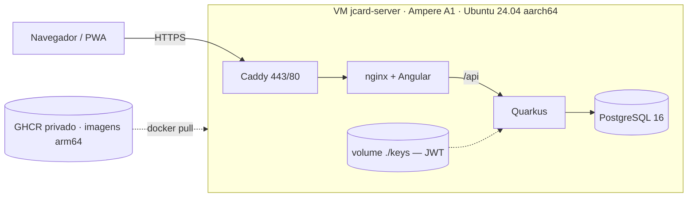

# Topologia de produção

Referência autoritativa da infraestrutura. **Uma VM Always Free** na Oracle
Cloud com a stack inteira, imagens buildadas no CI e publicadas no GHCR.



## Por que uma VM só

O app terá **no máximo ~10 pessoas**, cada uma abrindo o app algumas vezes por
mês, na virada da fatura. Isso não justifica duas máquinas.

A topologia de 2 VMs do projeto `ebd-samambaia` existiu por uma razão específica:
lá as máquinas são `E2.1.Micro` com **1 GB de RAM**, e Postgres + Quarkus juntos
não cabiam. Aqui a A1 tem 6–12 GB — o banco e o app convivem com folga.

Uma VM ainda traz três vantagens concretas:

- **Mais fácil de conseguir.** Capacidade Ampere em `sa-saopaulo-1` é escassa;
  uma alocação tem muito mais chance que duas.
- **Mais segura.** O Postgres fica só na rede interna do Docker, sem porta
  publicada em IP nenhum. Não há 5432 atravessando a rede para proteger.
- **Mais simples de operar.** Um compose, um `.env`, um backup.

## Por que Ampere A1, e não E2.1.Micro

O limite de `VM.Standard.E2.1.Micro` na tenancy é **2**, e as duas já são do
`ebd-samambaia`:

```
vm-standard-e2-1-micro-count →  limite: 2, used: 2, available: 0
```

Uma terceira exigiria pedido de aumento de limite à Oracle e sairia do Always
Free. A cota Ampere, por outro lado, está livre e é bem melhor.

> **Tetos do Always Free a respeitar.** A API reporta limites bem maiores (A1: 41
> OCPU e 277 GB; storage: 30 TB), mas isso é o teto administrativo da Oracle e
> **não** prova que a conta pode ser cobrada — conta Free Tier também mostra
> números altos. O tipo real está no console, em Billing → Subscriptions. De
> qualquer forma, a regra do projeto é não passar destes valores:
>
> | Recurso | Teto Always Free | Uso do JcardApp |
> |---|---|---|
> | A1 OCPU (tenancy toda) | 4 | 1–2 |
> | A1 memória (tenancy toda) | 24 GB | 6–12 GB |
> | Block storage (tenancy toda) | 200 GB | +50 GB (94 GB já são do EBD) |
>
> Fica sobrando cota de A1 — dá para crescer sem sair do gratuito.

## A VM

| | **jcard-server** |
|---|---|
| Shape | `VM.Standard.A1.Flex` · escada 2/12 → 1/6 → 1/4 → 1/3, conforme a capacidade |
| SO | Ubuntu 24.04 **aarch64** |
| Boot volume | 50 GB |
| Roda | `caddy` + `frontend` (nginx) + `backend` (Quarkus) + `db` (Postgres 16) |
| Compose | `docker-compose.yml`, em `~/jcardapp` |
| Região | `sa-saopaulo-1` · AD-1 |

**Capacidade é o gargalo.** A Oracle responde *"Out of host capacity"* para
Ampere com frequência. `scripts/oci-a1-retry.sh` percorre uma escada a cada
rodada — 2/12, 1/6, 1/4 e 1/3 — porque pedir menos aumenta muito a chance de
encaixar num host com pouco espaço livre.

O piso é **1 OCPU / 3 GB**. A A1.Flex aceita até 1 GB (igual às VMs do EBD), mas
1 GB não roda a stack inteira numa máquina só — foi exatamente por isso que o EBD
precisou de duas. Aqui Postgres, Quarkus, nginx e Caddy dividem a mesma VM.
Abaixo de 4 GB o `oci-bootstrap.sh` cria 3 GB de swap automaticamente, e os
limites de memória dos containers se ajustam pelo `.env` (`JCARD_MEM_*`).

A A1.Flex é **redimensionável**: parar a instância → editar o shape → ligar. Por
isso vale pegar a capacidade que aparecer e crescer depois, em vez de esperar
pelo tamanho ideal.

## Rede

VCN criada em 07/08/2026, **isolada** da rede do EBD (a subnet de lá tem regras
próprias; misturar os projetos bagunçaria as Security Lists).

| Recurso | Valor |
|---|---|
| VCN | `jcard-vcn` · `10.1.0.0/16` |
| Subnet pública | `jcard-subnet` · `10.1.1.0/24` |
| Gateway | `jcard-igw` + rota default `0.0.0.0/0` |
| Security list | `jcard-sl` — ingress **só** 22, 80, 443 e ICMP |

Não há regra para 5432: o Postgres não tem porta publicada no host, então é
inalcançável de fora por construção — não depende de firewall estar certo.

Os OCIDs ficam em `scripts/.oci-launch.env` (não versionado).

## Segurança

- HTTPS com **Caddy + Let's Encrypt** em `jcardapp.duckdns.org`, renovação automática.
- **Postgres sem porta publicada** — só a rede interna do compose enxerga.
- Chaves **JWT** montadas em runtime (`./keys` → `/keys`), gravadas pelo CD a
  partir dos secrets. A imagem não carrega segredo e os tokens sobrevivem ao deploy.
- O `.env` de produção vai para a VM com `chmod 600`.

## Operação

```bash
ssh -i ~/.ssh/jcard_deploy ubuntu@<IP> 'cd ~/jcardapp && docker compose ps'
ssh -i ~/.ssh/jcard_deploy ubuntu@<IP> 'cd ~/jcardapp && docker compose logs -f backend'
ssh -i ~/.ssh/jcard_deploy ubuntu@<IP> 'docker exec -it jcard-postgres psql -U jcard -d jcard'
curl -s https://jcardapp.duckdns.org/q/health
```

Backup manual enquanto o cron não está instalado:

```bash
ssh -i ~/.ssh/jcard_deploy ubuntu@<IP> \
  'docker exec jcard-postgres sh -c "PGPASSWORD=\$POSTGRES_PASSWORD pg_dump -U \$POSTGRES_USER \$POSTGRES_DB"' \
  | gzip > jcard-$(date +%F).sql.gz
```

## Se um dia precisar dividir

Não deve precisar nesta escala, mas o caminho é conhecido (foi o que o EBD fez):
criar uma segunda VM, mover o serviço `db` para um compose próprio nela, apontar
`QUARKUS_DATASOURCE_JDBC_URL` para o **IP privado** dela, e aí sim abrir a 5432
na Security List restrita ao `/32` da VM de app, reforçando no `iptables`.

## Conferir que continua grátis

Se a conta estiver com upgrade, a Oracle não bloqueia ao passar do gratuito —
ela cobra. Antes de mudar shape, criar volume ou ligar qualquer serviço novo:

```bash
bash scripts/verificar-custo-zero.sh
```

O script confere A1 (4 OCPU / 24 GB), block storage (200 GB), `E2.1.Micro` (2),
load balancers e backups de volume — e sai com erro se algo estourou.

Do lado do GitHub, os dois limites do plano Free que importam:

- **GHCR, 500 MB** em repositório privado. Cada deploy publica uma camada nova,
  então o CD apaga versões antigas e guarda 5 (o bastante para rollback).
- **Actions, 2.000 min/mês.** Semgrep e Trivy rodam só em PR e no cron semanal;
  build, testes, migrations e gitleaks rodam em todo push.

## Pendente

- [ ] VM A1 aguardando capacidade (`scripts/oci-a1-retry.sh` rodando)
- [ ] `oci-bootstrap.sh` na VM assim que subir
- [ ] DuckDNS apontado (`scripts/duckdns-update.sh`)
- [ ] Secrets `OCI_*` cadastrados → o CD sai do modo mock
- [ ] Backup diário do Postgres + offsite no Object Storage
