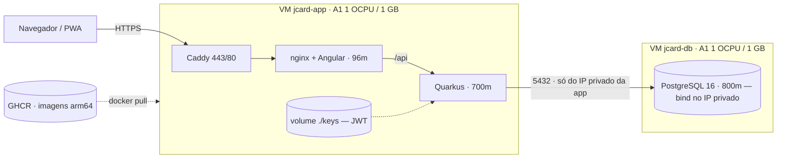

# Topologia de produção

Referência autoritativa da infraestrutura. **Duas VMs Always Free** na Oracle
Cloud, de 1 OCPU / 1 GB cada, com as imagens buildadas no CI e publicadas no GHCR.



## Por que duas VMs de 1 GB

Porque **1 GB não comporta Postgres e Quarkus na mesma máquina** — e 1 OCPU /
1 GB é o menor pedido que a A1.Flex aceita, o que maximiza a chance de encaixar
num host cheio quando a capacidade Ampere está escassa.

É exatamente a topologia que o `ebd-samambaia` roda em produção hoje, no mesmo
shape: um par de máquinas mínimas, cada uma com um papel, ambas com swap. Padrão
comprovado, não experimento.

O preço é a complexidade que uma VM só não teria: dois composes, dois bootstraps,
o 5432 atravessando a rede (com Security List **e** iptables protegendo) e dois
backups. Para ~10 pessoas usando algumas vezes por mês, a capacidade de máquina
sobra; o que custa aqui é operar.

## Por que Ampere A1, e não E2.1.Micro

O limite de `VM.Standard.E2.1.Micro` na tenancy é **2**, e as duas já são do
`ebd-samambaia`:

```
vm-standard-e2-1-micro-count →  limite: 2, used: 2, available: 0
```

Uma terceira exigiria pedido de aumento de limite à Oracle e sairia do Always
Free. A cota Ampere, por outro lado, está livre e é bem melhor.

> **Tetos do Always Free a respeitar.** Compute sobra: 2 OCPU e 2 GB dos 4/24.
> O que aperta é o **disco** — 50 GB de boot por VM é o mínimo, então duas VMs
> levam a conta a 194 GB dos 200 disponíveis, contando o EBD.
> A API reporta limites bem maiores (A1: 41
> OCPU e 277 GB; storage: 30 TB), mas isso é o teto administrativo da Oracle e
> **não** prova que a conta pode ser cobrada — conta Free Tier também mostra
> números altos. O tipo real está no console, em Billing → Subscriptions. De
> qualquer forma, a regra do projeto é não passar destes valores:
>
> | Recurso | Teto Always Free | Uso do JcardApp | Total com o EBD |
> |---|---|---|---|
> | A1 OCPU | 4 | 2 | 2 |
> | A1 memória | 24 GB | 2 GB | 2 GB |
> | Block storage | 200 GB | 100 GB | **194 GB** |
>
> Sobra cota de CPU e memória (dá para redimensionar as VMs depois sem sair do
> gratuito), mas o disco fica com só 6 GB de folga — não cabe uma terceira VM.

## As duas VMs

| | **jcard-app** | **jcard-db** |
|---|---|---|
| Shape | `A1.Flex` · 1 OCPU / 1 GB | idem |
| SO | Ubuntu 24.04 **aarch64** · 3 GB swap | idem |
| Boot volume | 50 GB | 50 GB |
| Roda | `caddy` + `frontend` + `backend` | `db` (Postgres 16) |
| Compose | `docker-compose.app.yml` | `docker-compose.db.yml` |

Limites de memória (os mesmos do EBD neste shape): backend **700m**, frontend e
Caddy **96m**, Postgres **800m**. O JVM usa `MaxRAMPercentage=60` e **SerialGC** —
com 1 vCPU, um coletor paralelo só disputaria CPU com a própria aplicação.

O **swap de 3 GB é obrigatório** aqui, criado pelo `oci-bootstrap.sh`: sem ele o
primeiro pico do Quarkus ou um `VACUUM` do Postgres levam OOM kill. Com
`swappiness=10` ele fica como rede de segurança, não como memória de uso corrente.

**Capacidade é o gargalo.** A Oracle responde *"Out of host capacity"* para
Ampere com frequência. `scripts/oci-a1-retry.sh` insiste em segundo plano até as
duas existirem; 1 OCPU / 1 GB é o menor pedido possível, o mais fácil de alocar.

Se um dia precisar de mais, a A1.Flex é **redimensionável** e ainda sobra cota:
parar a instância → editar o shape → ligar. Aí vale ajustar `JCARD_MEM_*` e
`JCARD_PG_*` no `.env`.

A A1.Flex é **redimensionável**: parar a instância → editar o shape → ligar. Por
isso vale pegar a capacidade que aparecer e crescer depois, em vez de esperar
pelo tamanho ideal.

## Rede

VCN criada em 07/08/2026, **isolada** da rede do EBD (a subnet de lá tem regras
próprias; misturar os projetos bagunçaria as Security Lists).

| Recurso | Valor |
|---|---|
| VCN | `jcard-vcn` · `10.1.0.0/16` |
| Subnet pública | `jcard-subnet` · `10.1.1.0/24` |
| Gateway | `jcard-igw` + rota default `0.0.0.0/0` |
| Security list | `jcard-sl` — 22, 80, 443, ICMP e **5432 restrita** |

A 5432 nasce liberada para a subnet (`10.1.1.0/24`) porque o IP privado da
`jcard-app` ainda não existe na criação. Depois que as VMs sobem, aperte para o
`/32`:

```bash
bash scripts/oci-restringir-db.sh <IP-privado-da-jcard-app>
```

O `oci-bootstrap.sh db` repete a restrição no `iptables` da própria `jcard-db` —
duas camadas, porque aqui o 5432 realmente trafega entre máquinas.

Os OCIDs ficam em `scripts/.oci-launch.env` (não versionado).

## Segurança

- HTTPS com **Caddy + Let's Encrypt** em `jcardapp.duckdns.org`, renovação automática.
- **Postgres nunca no IP público**: bind em `JCARD_DB_BIND_IP` (o IP privado), com
  a 5432 restrita ao `/32` da app na Security List e no iptables.
- Chaves **JWT** montadas em runtime (`./keys` → `/keys`), gravadas pelo CD a
  partir dos secrets. A imagem não carrega segredo e os tokens sobrevivem ao deploy.
- O `.env` de produção vai para a VM com `chmod 600`.

## Operação

```bash
# app
ssh -i ~/.ssh/jcard_deploy ubuntu@<IP-app> 'cd ~/jcardapp && docker compose -f docker-compose.app.yml ps'
ssh -i ~/.ssh/jcard_deploy ubuntu@<IP-app> 'cd ~/jcardapp && docker compose -f docker-compose.app.yml logs -f backend'
# banco
ssh -i ~/.ssh/jcard_deploy ubuntu@<IP-db> 'docker exec -it jcard-postgres psql -U jcard -d jcard'
# memória (importante neste shape)
ssh -i ~/.ssh/jcard_deploy ubuntu@<IP-app> 'free -h && docker stats --no-stream'
curl -s https://jcardapp.duckdns.org/q/health
```

Backup manual enquanto o cron não está instalado:

```bash
ssh -i ~/.ssh/jcard_deploy ubuntu@<IP-db> \
  'docker exec jcard-postgres sh -c "PGPASSWORD=\$POSTGRES_PASSWORD pg_dump -U \$POSTGRES_USER \$POSTGRES_DB"' \
  | gzip > jcard-$(date +%F).sql.gz
```

## Se um dia quiser juntar tudo numa VM

Sobra cota de A1 (usamos 2 dos 4 OCPU e 2 dos 24 GB), então dá para redimensionar
a `jcard-app` para, digamos, 2 OCPU / 8 GB, subir o Postgres nela pelo mesmo
compose e desligar a `jcard-db`. Ganha simplicidade e libera 50 GB de disco;
perde o isolamento entre banco e app.

## Conferir que continua grátis

Se a conta estiver com upgrade, a Oracle não bloqueia ao passar do gratuito —
ela cobra. Antes de mudar shape, criar volume ou ligar qualquer serviço novo:

```bash
bash scripts/verificar-custo-zero.sh
```

O script confere A1 (4 OCPU / 24 GB), block storage (200 GB), `E2.1.Micro` (2),
load balancers e backups de volume — e sai com erro se algo estourou.

Do lado do GitHub, os dois limites do plano Free que importam:

- **GHCR, 500 MB** em repositório privado. Cada deploy publica uma camada nova,
  então o CD apaga versões antigas e guarda 5 (o bastante para rollback).
- **Actions, 2.000 min/mês.** Semgrep e Trivy rodam só em PR e no cron semanal;
  build, testes, migrations e gitleaks rodam em todo push.

## Pendente

- [ ] VMs A1 aguardando capacidade (`scripts/oci-a1-retry.sh` rodando)
- [ ] `oci-bootstrap.sh app` e `oci-bootstrap.sh db` assim que subirem
- [ ] `oci-restringir-db.sh` para fechar a 5432 no /32
- [ ] DuckDNS apontado (`scripts/duckdns-update.sh`)
- [ ] Secrets `OCI_*` cadastrados → o CD sai do modo mock
- [ ] Backup diário do Postgres + offsite no Object Storage
